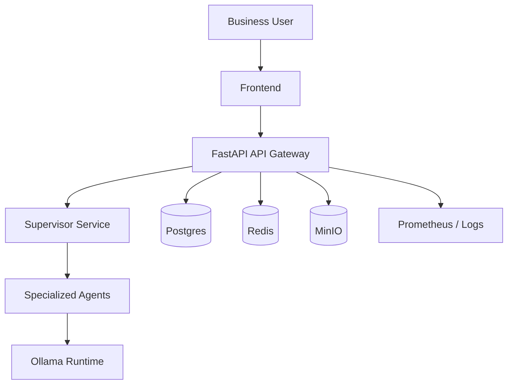
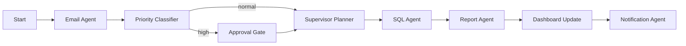

# Architecture Diagrams

## System Context

```mermaid
flowchart TD
    User[Business User] --> FE[Frontend]
    FE --> API[FastAPI API Gateway]
    API --> SUP[Supervisor Service]
    SUP --> Agents[Specialized Agents]
    Agents --> Ollama[Ollama Runtime]
    API --> DB[(Postgres)]
    API --> Cache[(Redis)]
    API --> ObjectStore[(MinIO)]
    API --> Obs[Prometheus / Logs]
```

## Workflow Execution

```mermaid
flowchart LR
  Start --> Email[Email Agent]
  Email --> Classify[Priority Classifier]
  Classify -->|high| Approval[Approval Gate]
  Classify -->|normal| Planner[Supervisor Planner]
  Approval --> Planner
  Planner --> SQL[SQL Agent]
  SQL --> Report[Report Agent]
  Report --> Dashboard[Dashboard Update]
  Dashboard --> Notify[Notification Agent]
```
